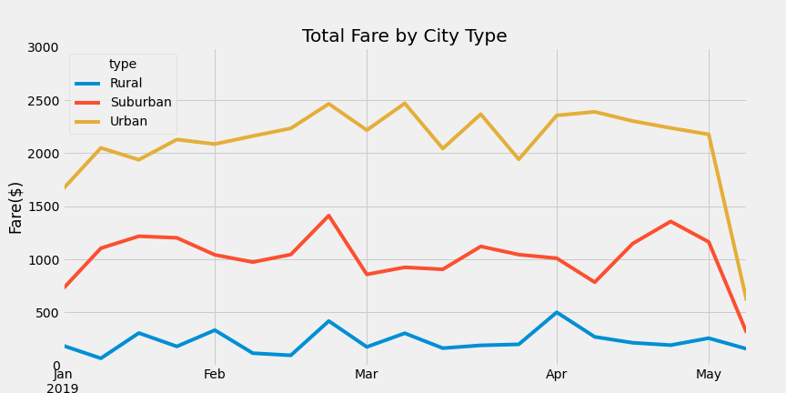
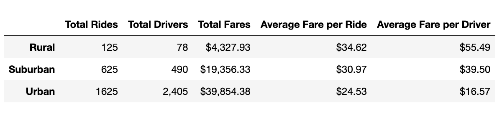
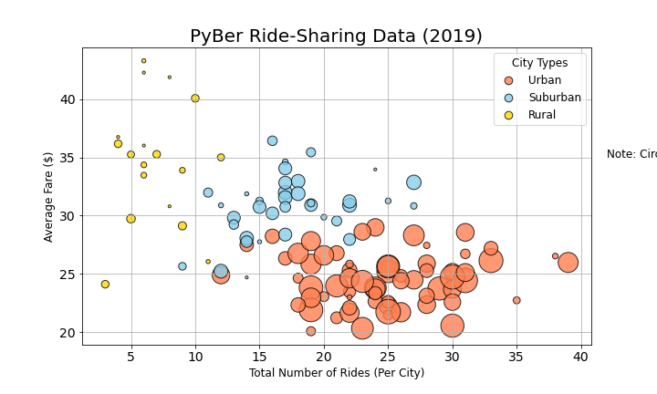
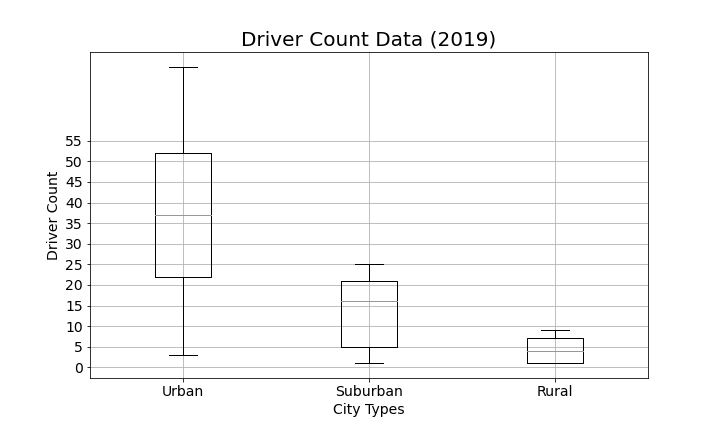
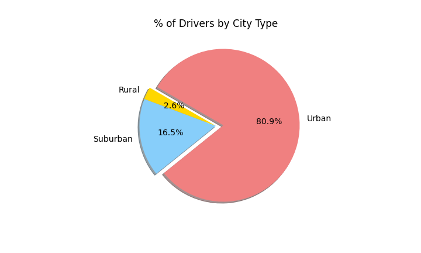
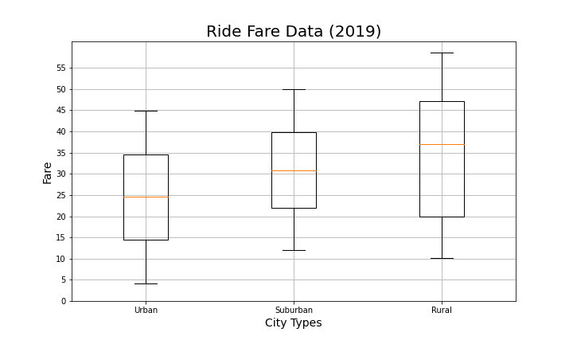
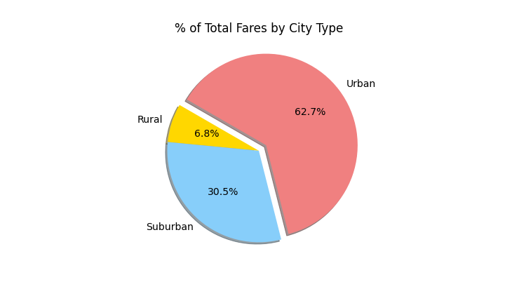

# PyBer_Analysis
## Overview of the analysis:

V. Isualize has given you and Omar a brand-new assignment. Using your Python skills and knowledge of Pandas, you’ll create a summary DataFrame of the ride-sharing data by city type. Then, using Pandas and Matplotlib, you’ll create a multiple-line graph that shows the total weekly fares for each city type. Finally, you’ll submit a written report that summarizes how the data differs by city type and how those differences can be used by decision-makers at PyBer.

## Results:

* Ride Sharing Data among city types

* Total Rides by city types

* Total drivers

* Total Fare

##Summary:

Urban Cities experienced an initial weekly growth from Jan through end of February but looks it reached the cap, number of available drivers being higher than demand drove average fare down. 

Suburban weekly Total Fare hovers around 1000 ,  data doesn't really show a consistent growth pattern, however there are weeks reflecting significant higher fares that are worth looking at. 

Rural Weekly data is consistently inconsistent, going up and down on a week by week basis. It is clear that the supply/demand plays a role on rural communities using/ needing the service. 

There is a clear distinction on data by city type. Rural areas with lower driver count has more rides per driver, and higher fare per drive. However due to the driver count being low total fare is only 6.8%  of total. 

Suburban

###Recommendations:

- There was an increase on total fare for 3 city types last week of February. It is worth looking into more detail to see if there are strategies that can be applied in the future.  

- Look for potential opportunities to expand coverage/ratio  of suburban drivers into rural areas, and Urban into Suburban.

- Rural areas  could have the potential for additional drivers. 

