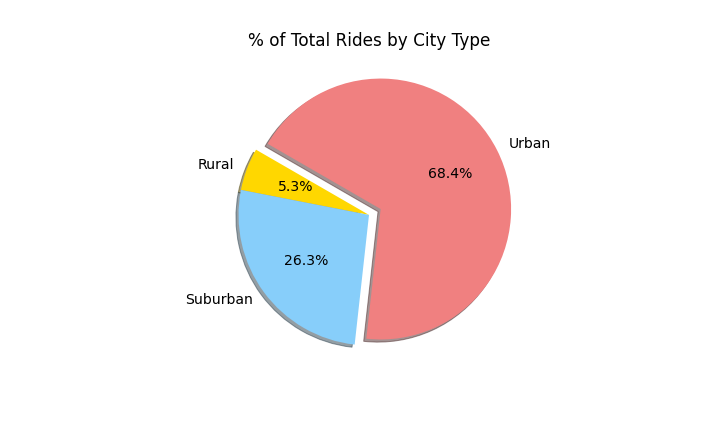

# PyBer_Analysis
## Overview of the analysis:

V. Isualize has given you and Omar a brand-new assignment. Using your Python skills and knowledge of Pandas, you’ll create a summary DataFrame of the ride-sharing data by city type. Then, using Pandas and Matplotlib, you’ll create a multiple-line graph that shows the total weekly fares for each city type. Finally, you’ll submit a written report that summarizes how the data differs by city type and how those differences can be used by decision-makers at PyBer.

## Results:

* Ride Sharing Data among city types

* Total Rides by city types

* Total drivers

* Total Fare

##Summary:

There is a clear distinction on data by city type. Rural areas with lower driver count but more rides per driver,  

###Recommendations:

